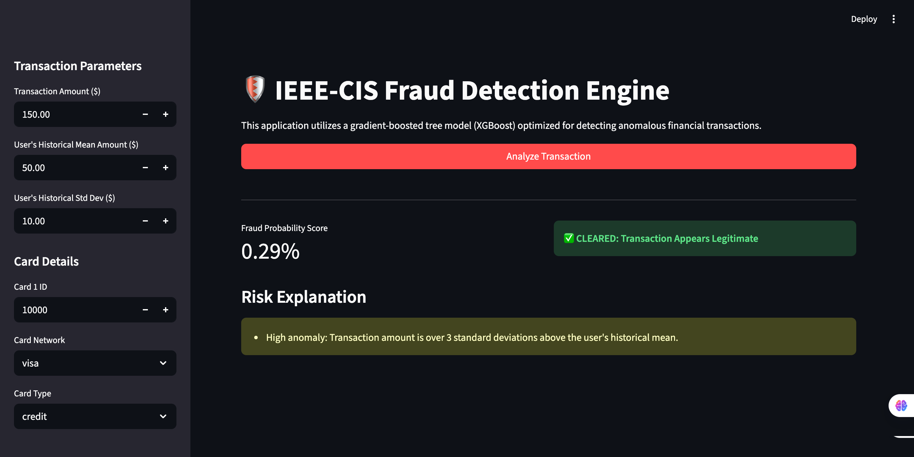

# 🛡️ Financial Fraud Detection Engine
**Live Application Interface**


## 📌 Business Abstract

**In the financial services sector, undetected fraudulent transactions lead to direct revenue loss, while overly aggressive fraud filters cause high false-positive rates, resulting in user friction and customer churn.**

**This project implements an end-to-end Machine Learning pipeline designed to identify anomalous financial transactions. Built on the** [IEEE-CIS Fraud Detection dataset](https://www.kaggle.com/c/ieee-fraud-detection), this system utilizes a highly optimized Gradient Boosted Decision Tree (XGBoost) architecture and includes a local, interactive front-end for real-time transaction inference and risk scoring.

## 🏗️ Technical Architecture & Stack

* **Model Engine:** XGBoost (`binary:logistic`) utilizing histogram-based tree methods for memory-efficient training on high-cardinality datasets.  
* **Front-End Deployment:** Streamlit application simulating real-time transaction scoring and feature injection.  
* **Data Processing:** Pandas & NumPy for vectorized aggregations, historical feature store simulation, and strict label encoding.

## 🧠 Key Engineering Achievements

1. **Target Metric Optimization:** Standard accuracy is a flawed metric for highly imbalanced datasets. This model was strictly evaluated on **AUPRC (Area Under the Precision-Recall Curve)**.   
2. **Device Fingerprinting & Normalization:** Extracted distinct vendor hardware signatures from unstructured, noisy `DeviceInfo` strings (e.g., mapping granular iOS/Windows build versions to parent OS categories).  
3. **Simulated Historical Feature Store:** Engineered composite primary keys (`uid` \= Card \+ Address \+ Email) to track historical user behavior. Developed normalized features such as `TransactionAmt_normalized`, representing the z-score deviation of a current transaction against a user's historical mean.  
4. **Email Intelligence Mappings:** Aggregated disparate sub-domains into parent tech organizations (e.g., `ymail.com` \-\> `yahoo`) and engineered binary flags identifying purchaser-to-recipient domain mismatches.

## 🚀 Installation & Local Deployment Guide

### 1\. Clone the Repository & Prepare Environment

It is highly recommended to use a virtual environment to prevent dependency conflicts.

\`git clone https://github.com/noshadnibir/cis-fraud-detection.git

cd fraud-detection-engine

python \-m venv venv

source venv/bin/activate  \# On Windows use: venv\\Scripts\\activate

pip install \-r requirements.txt\`

### 2\. Data Ingestion

Download the [IEEE-CIS Fraud Detection dataset](https://www.kaggle.com/c/ieee-fraud-detection/data). Extract and place \``` train_transaction.csv` `` and \``` train_identity.csv` `` into the \``` ./data/` `` directory.

### 3\. Generate Model Artifacts

Execute the training pipeline. This will process the raw data, train the XGBoost model, and serialize the required inference artifacts \`(`xgboost_model.json`, `encoders.pkl`, `feature_names.pkl`)\`.

### 4\. Launch the Inference Application

Start the local Streamlit server to interact with the model via the UI.

\`streamlit run app.py\`